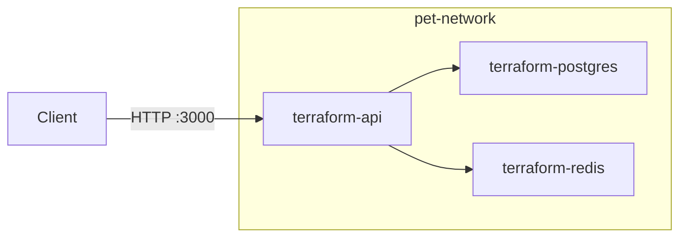

# terraform-project

Infrastructure-as-code for a small **notes API** stack: Terraform provisions Docker containers for PostgreSQL, Redis, and a Node.js (Fastify) API. The API persists notes in Postgres and caches list responses in Redis.

## Architecture



| Component | Container name | Image / build |
|-----------|----------------|---------------|
| API | `terraform-api` | Built from `app/` (`terraform-image-api:<tag>`) |
| PostgreSQL | `terraform-postgres` | `postgres:16` |
| Redis | `terraform-redis` | `redis:8` |

All services share the Docker network `pet-network`. Only the API publishes a host port (`3000`). Postgres and Redis are reachable from other containers on that network, not from the host unless you add port mappings yourself.

## Prerequisites

- [Terraform](https://www.terraform.io/downloads) **>= 1.5.0**
- [Docker](https://docs.docker.com/get-docker/) (daemon running; Terraform uses the Docker provider to create containers and build the API image)
- For local app development (optional): Node.js 20+ and [Yarn](https://yarnpkg.com/)

## Project layout

```
.
├── app/                 # Fastify API (TypeScript)
│   ├── src/index.ts
│   ├── Dockerfile
│   └── package.json
└── terraform/           # Terraform root module
    ├── main.tf          # Docker network, Postgres, Redis, API
    ├── variables.tf
    ├── outputs.tf
    ├── providers.tf
    └── terraform.tfvars # Your values (do not commit secrets in real setups)
```

## Configure Terraform

Copy or edit `terraform/terraform.tfvars`. Required and common variables:

| Variable | Description | Default |
|----------|-------------|---------|
| `postgres_password` | Postgres password (**required**, sensitive) | — |
| `postgres_user` | Postgres user | `app_user` |
| `postgres_db` | Database name | `notes_db` |
| `image_tag` | Tag for the built API image | `dev` |

Example `terraform/terraform.tfvars`:

```hcl
postgres_password = "your-secure-password"
# postgres_user     = "app_user"
# postgres_db       = "notes_db"
# image_tag         = "dev"
```

You can also pass variables on the CLI, e.g. `-var='postgres_password=...'`, or set `TF_VAR_postgres_password` in the environment.

## Run with Terraform

All commands below are run from the **`terraform/`** directory.

```bash
cd terraform
terraform init
terraform plan
terraform apply
```

- **`terraform init`** — Downloads the [kreuzwerker/docker](https://registry.terraform.io/providers/kreuzwerker/docker/latest) provider.
- **`terraform plan`** — Shows containers, network, and image build changes.
- **`terraform apply`** — Creates the network, starts Postgres and Redis, builds the API image from `../app`, and starts the API container.

After a successful apply, the API is available at **http://localhost:3000**.

Useful outputs (Postgres/Redis URLs are illustrative for in-network access; the API is what you call from the host):

```bash
terraform output
```

Teardown:

```bash
terraform destroy
```

Rebuilding the API image after code changes: run `terraform apply` again so Terraform rebuilds the image when the build context changes.

## API usage

Base URL when the stack is up: **http://localhost:3000**

### Health check

```bash
curl -s http://localhost:3000/health
```

Example response:

```json
{"status":"ok"}
```

### Create a note

`POST /notes` — body must include `text`.

```bash
curl -s -X POST http://localhost:3000/notes \
  -H 'Content-Type: application/json' \
  -d '{"text":"My first note"}'
```

Example response:

```json
{"id":1,"text":"My first note"}
```

Creating a note invalidates the Redis cache key used for listing.

### List notes

```bash
curl -s http://localhost:3000/notes
```

Returns an array of notes (`id`, `text`), newest first by `id`. The first request loads from Postgres and caches the result in Redis; later requests may be served from cache until another note is created.

## Application (without Terraform)

To work on the API locally you need Postgres and Redis reachable at the same hostnames the app expects, or adjust env vars in `app/src/index.ts` / your shell.

From `app/`:

```bash
yarn install
yarn build
# Example env when services run as Terraform container names on a shared network:
export DB_HOST=terraform-postgres DB_USER=app_user DB_PASSWORD=... DB_NAME=notes_db REDIS_HOST=terraform-redis
yarn start
```

The Docker image used by Terraform runs `yarn build` then `yarn start` (see `app/Dockerfile`).

## Environment variables (API container)

Set by Terraform in `main.tf` for the API container:

| Variable | Purpose |
|----------|---------|
| `DB_HOST` | Postgres hostname (`terraform-postgres`) |
| `DB_USER` | Postgres user |
| `DB_PASSWORD` | Postgres password |
| `DB_NAME` | Database name |
| `REDIS_HOST` | Redis hostname (`terraform-redis`) |

## Notes

- **State**: Terraform state is local by default (`terraform.tfstate` in `terraform/`). That path is gitignored; do not commit state or `.terraform/`.
- **Secrets**: Keep `postgres_password` out of version control in production; use `terraform.tfvars` locally (gitignored if you add it) or CI secrets / `TF_VAR_*`.
- **Provider**: Requires a working Docker socket; the provider block is in `terraform/providers.tf`.
